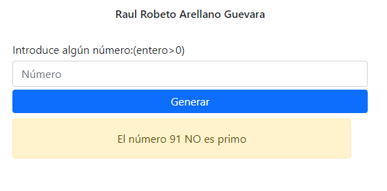

**Página para saber si un número primo con php responsive**

* uso de funciones en php
* metodo post para el envio de datos

Imagen de salida cuando el número es primo

Imagen de salida cuando el número No es primo

Comprobación de dato ingresado que no se caracter

